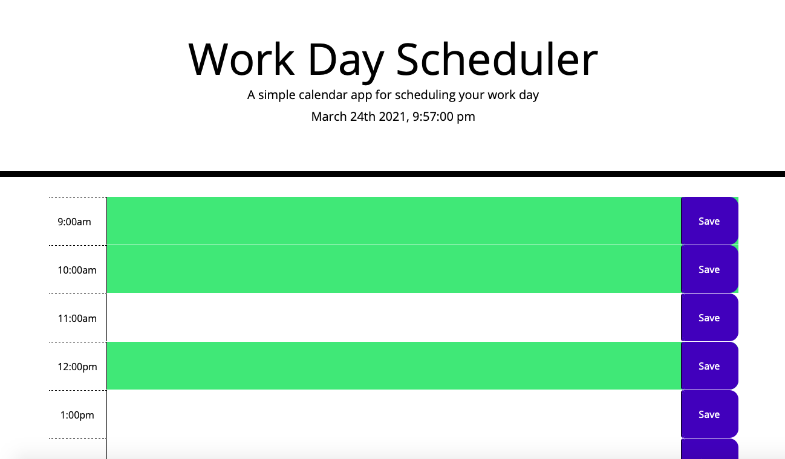

this week we were given a homework to create a work day planner with HTML CSS and Javascript
the HTML and the CSS were already provided all we needed to do was add the JS 
<<<<<<< HEAD

=======
launched app link
https://jayjay2397.github.io/WorkDayScheduler/.
>>>>>>> 7e24d02d34e3f7448aa9eee778538f75bddc6eb2
